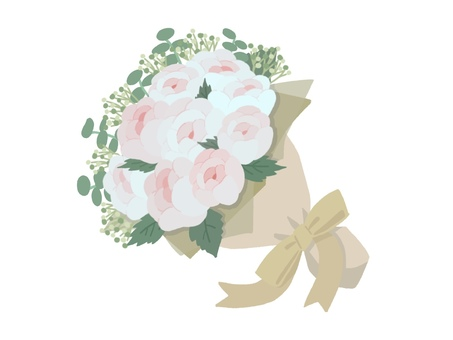

<html lang="en">
<head>
    <meta charset="UTF-8">
    <meta name="viewport" content="width=device-width, initial-scale=1.0">
    <title>Happy Birthday!</title>
    
</head>
<body>
    <h1>Happy Birthday Pre!</h1>
    
Click mo yung button hehe

    <button class="button" onclick="revealSurprise()">Click me!</button>
    
    

        
        
Here’s a White rose bouquet just for you, kase you’re the white rose in my heart’s garden.:

        
    

    
</body>
</html>
